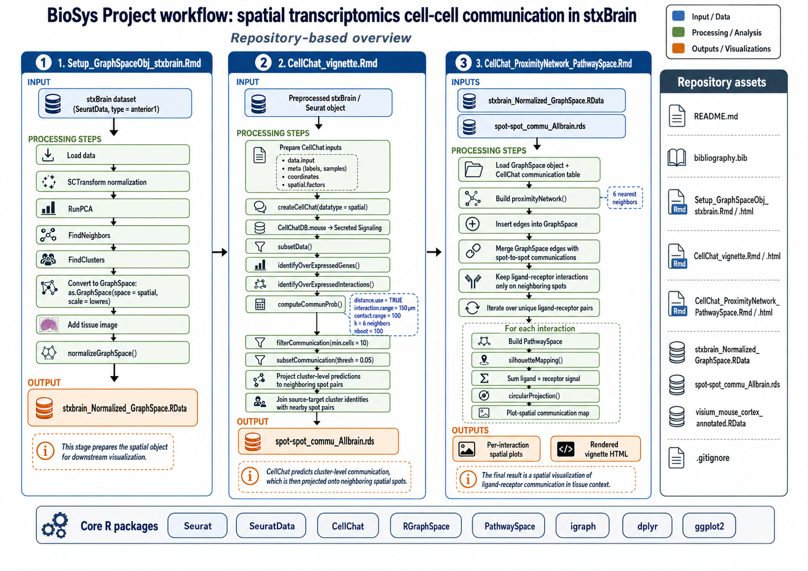
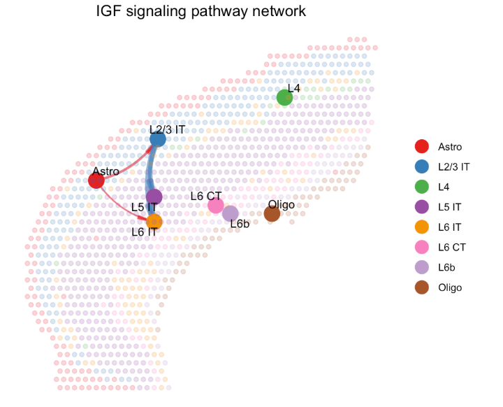

```{r setup, include=FALSE}
knitr::opts_chunk$set(
  echo = TRUE,
  warning = FALSE,
  message = FALSE,
  fig.align = "center",
  fig.width = 7,
  fig.height = 5
)
```

# Introdução

Ainda em desenvolvimento, a transcriptômica espacial (TE) tem ganhado espaço por fornecer informações que outras técnicas ainda não foram capazes de endereçar. O transcriptômica de alta performance (RNA-seq) permitiu a análise em larga escala dos perfis de expressão gênica, porém perde-se a informação de quais células tal expressão se origina. A transcriptômica de células únicas (scRNA-seq) endereçou essa limitação. A expressão, como objeto, passou a ser analisada conjuntamente com as células, enquanto sujeitas, em seus variados tipos e estados. Contudo, perde-se ainda a informação de localização destas células, impedindo análises que considerem a sua vizinhança ou estrutura tecidual. Este é o ponto em que se insere a TE: permite avaliar o perfil de expressão gênica, resgatar informações dos tipos celulares e avaliar o microambiente celular dos tecidos. Assim, a TE insere contexto à análise de expressão gênica.

Dados single-cell têm sido utilizados pela comunidade científica há mais de dez anos e isso contribuiu para a maturidade técnica na análise desses dados [@Quake2022], como estabelecimento de protocolos padrão para demultiplexagem, correção dos dados, normalização de lotes. No campo da TE, apesar de haver um grande acréscimo de produção de dados, ainda existem lacunas de análise e preprocessamento desse tipo de dados. Os dados de TE enfrentam diversos desafios, como: redução do ruído em visualizações, compensação de dados com baixa resolução, clusterizações direcionadas por localização e outras [@Fang2023].

Resumidamente, dados de TE são semelhantes aos dados de scRNA-seq uma vez que a estrutura básica consiste em um número *n* de células --- *spots* no caso da TE --- e um número *f* de *Features*, i.e. transcritos. Fundamentalmente, a principal diferença entre single-cell e TE consiste em que a segunda possui *spots* com coordenadas espaciais `x,y`. Assim, os primeiros esforços de visualização de dados de TE focaram em apresentar o sinal de maneira discreta, i.e. um sinal para cada *spot*. Essa abordagem foi adotada pelo pacote Seurat [@Hao2023Seurat], que já está consolidado dentre a comunidade R. Além disso, uma das primeiras abordagens de projeção do sinal de TE de maneira contínua foi o pacote PathwaySpace [@Tercan2025PathwaySpace; @Ellrott2025CancerSubtypes], implementado pelo grupo de pesquisa do autor.

Considerando as versões 1 e 2 da plataforma Visium (10x Genomics, Califórnia EUA) [@Stahl2016], existe um espaço entre-spots de 100 µm. Por essa razão, a projeção com PathwaySpace permite uma visualização contínua e harmônica do sinal. Além disso, a estrutura de dados do objeto PathwaySpace consiste em considerar cada spot como um vértice de um grafo, que está dentro de um sistema de coordenadas normalizado. 

O pacote CellChat recebe dados de scRNA-seq ou TE anotados e cria inferências de comunicação célula-célula [@Jin2021CellChat; @Jin2025CellChat]. Tal inferência é calculada através comparação de grupos de *spots* que pertençam a um mesmo tipo celular. Com isso, a visualização da comunicação celular oferecida pelo pacote fica restrita. Nesse contexto pretende encaixar-se o presente projeto de análise: harmonizar os dados de comunicação celular para uma visualização contínua a nível de *spot*. Para tanto, se pretende utilizar a infraestrutura já disponível no pacote PathwaySpace.

# Objetivos

## Objetivo geral

Estabelecer uma estratégia de análise que apresente uma visualização contínua de pares ligante-receptor enquanto dado de comunicação celular em dados de transcriptômica espacial.

## Objetivos específicos

-   Carregar um *dataset* exemplo de TE, preprocessar e convertê-lo para um objeto `PathwaySpace`.
-   Realizar a inferência de comunicação celular utilizando o CellChat.
-   Aumentar a granulosidade do dado de saída do CellChat, a nível de *spot*.
-   Identificar pares ligante-receptor entre *spots* vizinhos no objeto `PathwaySpace`.
-   Visualizar, de maneira contínua, o dado de comunicação celular.

# Materiais e Métodos

## Materiais

Neste projeto, foram utilizados dados de transcriptômica espacial do conjunto `stxbrain`, processados em R e convertidos para um objeto `PathwaySpace` compatível com o fluxo de análise. O *dataset* `stxbrain` é obtido através do pacote Seurat e consiste em um corte sagital de um encéfalo de camundongo. O `stxbrain` possui 2.696 *spot* e 17.668 *features* (transcritos).

O mesmo *dataset* foi preprocessado e utilizado como entrada do pacote CellChat. Assim, gerou-se um *data frame* com a inferência de todos os pares ligante-receptor entre os *spots* vizinhos. Com o os *datasets* de TE e de comunicação celular em mãos, a análise final de visualização foi realizada.

### Arquivos e repositório computacional

Todos os códigos, objetos intermediários e vinhetas necessários para a realização do projeto estão disponíveis no repositório:

<https://github.com/flaviogckessler/BioSys_Project>

Arquivos principais do projeto:

-   `Setup_GraphSpaceObj_stxbrain.Rmd`: preparação do objeto `GraphSpace` a partir dos dados `stxbrain`.
-   `CellChat_vignette.Rmd`: inferência de comunicação célula-célula com `CellChat`.
-   `CellChat_ProximityNetwork_PathwaySpace.Rmd`: análise principal e visualização das interações espaciais com `PathwaySpace`.
-   `stxbrain_Normalized_GraphSpace.RData`: *dataset* `stxBrain` normalizado e convertido como objeto `GraphSpace`.
-   `spot-spot_commu_Allbrain.rds`: pares de comunicação celular a nível de spot inferidos com `CellChat`.
-   `bibliography.bib`: referências bibliográficas utilizadas no projeto.
-   `Relatorio_FlavioKessler_BioSys.Rmd`: Arquivo do relatório final do projeto de análise.

## Métodos

```{r workflow-placeholder, eval=TRUE,echo=FALSE, fig.cap="**Figura 1. Fluxo geral da análise realizada no projeto.** Na primeira vinheta, o dado de transcriptômica espacial é carregado, preprocessado e armazenado. Na segunda vinheta, a inferência da comunicação celular é conduzida utilizando o pacote CellChat. Por fim, a última vinheta manipula o objeto PathwaySpace e apresenta uma visualização com o sinal da comunicação celular projetado no dado de transcriptômica espacial. Imagem gerada por IA."}

```

### Visão geral do fluxo de trabalho

O fluxo de trabalho seguiu as seguintes etapas:

1.  Pré-processamento dos dados de transcriptômica espacial (`stxBrain`).
2.  Conversão dos dados para objeto `GraphSpace`.
4.  Inferência de comunicação célula-célula com `CellChat`.
5.  Filtragem e organização dos pares ligante-receptor *spot-spot*.
3.  Construção de rede de proximidade espacial entre *spots*.
6.  Visualização espacial das comunicações celulares com `PathwaySpace`.

### Processamento dos dados espaciais

A descrição pormenorizada do preprocessamento dos dados espaciais está disponível na primeira vinheta do fluxo de trabalho, por favor acessar:

1ª Vinheta [Setup vignette](https://flaviogckessler.github.io/BioSys_Project/Setup_GraphSpaceObj_stxbrain.html)

### Inferência de comunicação célula-célula com CellChat

A inferência da comunicação celular está descrita em detalhes na segunda vinheta do fluxo de trabalho, por favor acesse:

2ª Vinheta [CellChat vignette](https://flaviogckessler.github.io/BioSys_Project/CellChat_vignette.html)

### Visualização da comunicação celular com PathwaySpace

Os métodos utilizados para conduzir a integração dos dados espacias com a comunicação celular e a posterior visualização com o pacote PathwaySpace estão disponíveis em:

3ª Vinheta [PathwaySpace cell communication vignette](https://flaviogckessler.github.io/BioSys_Project/CellChat_ProximityNetwork_PathwaySpace.html)

### Método de referência para comparação

A estrutura de análise central do pacote CellChat calcula a inferência da comunicação celular em agrupamentos de células/spots. Tais agrupamentos podem ser, por vezes, tipos celulares como na Figura 2 abaixo. No caso do fluxo de trabalho utilizado no projeto, foram utilizados grupos clusterizados de *spots*. Assim, a visualização da inferência oferecida pelo pacote de referência, CellChat, agrega os *spots* nos agrupamentos utilizados de entrada na análise (Vide Figura 2). Assim, a visualização oferecida (i) não possui uma resolução a nível de *spot*, como também (ii) não permite projeção contínua do dado analisado.

```{r figure2, eval=TRUE,echo=FALSE, fig.cap="**Figura 2. Figura-exemplo da plotagem do CellChat.** O pacote CellChat agrega os tipos/grupos celulares para plotar os dados de inferênca de comunicação celular. Imagem retirada de vinheta do CellChat."}

```
Fonte: material complementar disponível em [Vinheta CellChat](https://htmlpreview.github.io/?https://github.com/jinworks/CellChat/blob/master/tutorial/CellChat_analysis_of_spatial_transcriptomics_data.html).

# Resultados e Discussão

A Figura 3 apresenta seis exemplos de pares ligantes-receptor entre *spots* vizinhos. Como pretendido, foi possível utilizar a infraestrutura do pacote PathwaySpace para realizar um visualização contínua que possua resolução a nível de *spot*. Em comparação com a figura de referência oferecida pelo CellChat (Vide Figura 2), a visualização gerada pelo projeto de análise apresenta uma maior granulosidade a agrega de maneira intuitiva a informação espacial. Tal informação é apresentada uma vez que a projeção do sinal abrange apenas os *spots* vizinhos que possuem relação de comunicação celular. Apesar de a Figura 3 apresentar apenas seis exemplos, é possível realizar a a visualização para todos os pares de ligante-receptor disponíveis.

```{r fig3, eval=TRUE,echo=FALSE,fig.cap="**Figura 3. Visualização final proposta pelo projeto de análise.** Os painéis A--F apresentam seis diferentes visualizações de pares ligante-receptor de *spots* vizinhos em dados de transcriptômica espacial."}

library(magick)
library(ggplotify)
library(patchwork)

# Liste aqui os nomes exatos dos arquivos salvos na pasta figures
plot_files <- file.path(
  "figures",
  c(
    "plot1.png",
    "plot2.png",
    "plot3.png",
    "plot4.png",
    "plot5.png",
    "plot6.png"
  )
)

# Verifica se todos os arquivos existem
stopifnot(all(file.exists(plot_files)))

# Lê as imagens e converte cada uma para um objeto compatível com ggplot/patchwork
plots <- lapply(plot_files, function(x) {
  as.ggplot(magick::image_read(x))
})

# Agrega os seis painéis em uma única figura
fig_seis_plots <- wrap_plots(plots, ncol = 3) +
  plot_annotation(tag_levels = "A")

fig_seis_plots
```

## Limitações

Apesar de o objetivo principal do projeto de análise ter sido atingido, é necessário considerar algumas limitações que restringem a abrangência dos resultados obtidos:

1.  A inferência de comunicação celular calculada pelo CellChat é realizado por grupos de células/spots. Portanto, o pacote não realiza inferência por pares de *spots*. No fluxo de trabalho, foi necessário transmitir os dados calculados para os pares de *spots*, aumentando artificialmente a granulosidade da inferência.
2.  A infraestrutura do PathwaySpace não foi construída com o objetivo de manipulação e edição de nós e arestas após a construção do objeto `GraphSpace/PathwaySpace`. A filtragem conduzida pela análise, que alterou diretamente os *slots* dos nós e arestas, é considerada subótima por contornar as estruturas internas de validação do objeto.
3.  A natureza do sinal de comunicação celular de pares ligante-receptor de spots vizinhos agrega por si só: uma aresta, dois nós (*spots*) e dois *Features* (ligante e receptor). Para permitir o cálculo da projeção pelo PathwaySpace, esses sinais foram agregados com a soma simples dos *counts* dos *Features*. A soma simples dos *counts* não é necessariamente a melhor métrica, análises subsequentes devem abordar qual agregação de sinal possui o maior sentido biológico.

# Conclusão

Dado o objetivo estabelecido, o projeto foi capaz de apresentar uma estrutura coesa de análise para a visualização contínua da comunicação celular em dados de transcriptômica espacial. Como apresentado, o projeto possui diversas limitações de uso e sua interpretação biológica deve ser considerada, por ora, com cautela.

O fluxo de trabalho oferece uma solução para a visualização de sinais de dados relacionais no contexto da TE. Com isso, a estrutura de análise pode ser triangulada para quaisquer dados que atendam as seguintes premissas: que possua um (i) sinal único para a renderização final e que (ii) pretenda agregar a informação espacial de *spots* vizinhos. Assim, a estrutura da análise não limita-se apenas aos dados de comunicação celular.

Por fim, é possível dizer que as projeções finais apresentaram uma maior granulosidade que a visualização de referência. Além disso, a abordagem agrega necessariamente a informação espacial.

# Declaração de Uso de Inteligência Artificial

Ao longo do preparo do relatório final a ferramenta de inteligência artificial **GPT-5.5 Thinking** (OpenAI,Califórnia EUA) foi utilizada em algumas tarefas relacionadas ao desenvolvimento do trabalho. Todos os usos da ferramenta são listados na tabela abaixo. Declara-se que todos os *promps* foram redigidos pelo autor e que este, além de ter revisado todas as respostas fornecidas pela ferramenta, assume total responsabilidade em relação ao material produzido.

```{r AI-usage, echo=FALSE}
uso_ia <- data.frame(
  `Ferramenta de IA` = c(
    "ChatGPT",
    "ChatGPT",
    "ChatGPT",
    "ChatGPT",
    "ChatGPT",
    "ChatGPT",
    "ChatGPT",
    "ChatGPT"
  ),
  `Forma de uso` = c(
    "Organização da estrutura do relatório técnico em formato R Markdown.",
    "Solução de bugs durante a redação dos scripts.",
    "Apoio na descrição metodológica do fluxo computacional utilizado no projeto, especificamente na vinheta 'CellChat_vignette.Rmd'",
    "Conversão do script R para a estrutura básica da vinheta em R Markdown.",
    "Auxílio na gestão do repositório GitHub. Sugestão de comandos no Git Bash, como 'git status', 'git add', 'git commit -m', 'git push'.",
    "Apoio na resolução de problemas técnicos relacionados à compilação do relatório em PDF a partir do R Markdown.",
    "Elaboração da imagem de fluxo de trabalho.",
    "Adaptação das referências no modelo Bibtex."
  ),
  `Parte do trabalho` = c(
    "Estrutura básica do documento.",
    "Materiais e Métodos; scripts e vinhetas.",
    "Materiais e Métodos; vinheta 'CellChat_vignette'.",
    "Materiais e Métodos; vinheta 'Setup_GraphSpaceObj_stxbrain'.",
    "Repositório do GitHub",
    "Formatação e compilação do documento final.",
    "Visão geral.",
    "Referências"
  ),
  check.names = FALSE
)

knitr::kable(
  uso_ia,
  caption = "Declaração de uso de ferramentas de inteligência artificial no desenvolvimento do relatório técnico.",
  align = "l"
)
```

# Referências Bibliográficas {.unnumbered}
